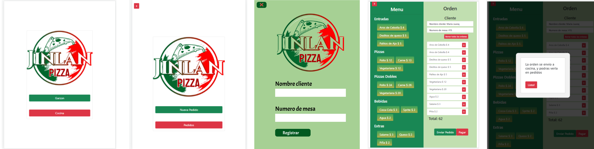

# JinLan Pizza 🍕

## Índice

* [JinLan Pizza ](#jinlan-Pizza)
* [Historia de Usuario](#historia-de-usuario)
* [Prototipos](#prototipos)
* [Interfaz](#interfaz)
* [Tecnologias](#tecnologias)
* [Link](#link)

***

## JinLan Pizza
Es una aplicación web para un restaurante con necesidad de poder agilizar la toma, gestión y entrega de pedidos, esta diseñada para usarse en dispositivos tipo tablet. Almacenando los datos en la nube y actulizandoce en tiempo real.

El meserx crea el pedido con nombre del cliente y número de mesa, toma el pedido, lo envia a la sección de pedidos en desarrollo y simultaneamente a cocina para ser preparado.

## Historia de Usuario

### 1. Mesero/a debe poder tomar pedido de cliente

Yo como meserx quiero tomar el pedido de un cliente para no depender de mi mala memoria, para saber cuánto cobrar, y enviarlo a la cocina para evitar errores y que se puedan ir preparando en orden.

## Criterios minimos de aceptación
- Anotar nombre de cliente.
- Agregar productos al pedido.
- Eliminar productos.
- Ver resumen y el total de la compra.
- Enviar pedido a cocina (guardar Firebase v-9).
- Se ve y funciona bien en una tablet.

## Definición de terminado
- Identificar el cliente y crear nueva mesa.
- Ruta de menú implementada.
- Menú Json creado y accesible.
- Al seleccionar el pedido, de forma interactiva se visualiza los productos y el total del pedido.
- El pedido se envía a la colección firestore "orders".
- Cada pedido se puede visualizar en la sección de Pedidos, resumen que consta con nombre del cliente, número de mesa, nombre del mesero o mesera y productos pedidos con su respectiva cantidad y precio y el total.
- Diseño de interfaz terminado.

## Prototipos

Prorotipos de baja fidelidad

Prorotipos de alta fidelidad

<h1> Mesero </h1>

<h1> Cocina </h1>

 

## Interfaz

## Tecnologias
- React.js.
- JavaScript ES6.
- Firebase v9.
- Bootstrap 5.
- Css
## Link
